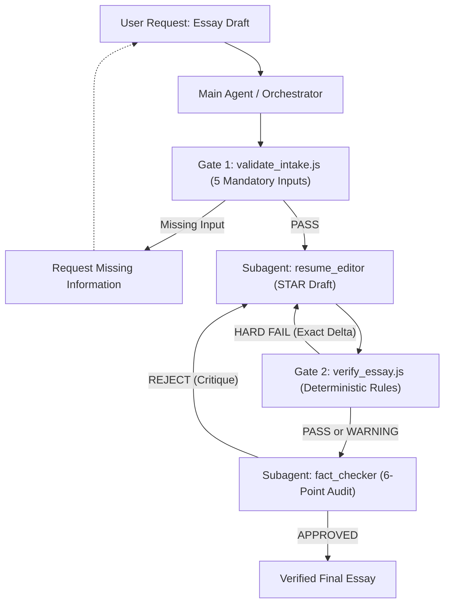

# 🚀 Resume-Helper-AgenticAI

> **"Beyond simple prompt engineering: Decoupling Hard Constraints from Heuristic Quality Signals, enforced by a deterministic verification engine and verified with boundary regression tests."**

Resume-Helper-AgenticAI is an autonomous, multi-agent closed-loop system designed for high-stakes employment essays and technical applications. It eliminates LLM hallucinations, blocks corporate clichés, strictly enforces character and byte constraints, and preserves authentic candidate voice through deterministic code verification.

---

## 🏗️ System Architecture



---

## 🎯 Core Principles

### 1. Orthogonality: Hard Constraints vs. Heuristic Quality Signals
- **Hard Constraints (`FAIL` ➔ Mandatory Automated Revision)**:
  - Exact character limits (with/without spaces).
  - Deterministic byte bounds (`Buffer.byteLength(str, 'utf8')` for UTF-8, exact code-point calculation for EUC-KR/CP949).
  - Factual integrity: Hallucinated algorithms, fabricated metrics, or company name mismatches.
- **Heuristic Quality Signals (`PASS + WARNING` ➔ Advisory Improvements)**:
  - Corporate clichés & buzzwords (`synergy`, `passionately worked overnight`, etc.).
  - Sentence length uniformity / monotony analysis (`Sentence Variance`).
  - Phrasing and flow suggestions.
  - *Heuristic warnings are fed back to the editor, but DO NOT artificially fail a draft or trigger infinite loops.*

### 2. Boundary-Condition Regression Test Suite
Enforces exact contracts with 12 regression tests across both orthogonality and boundary conditions:
- **BC01 (Exact Max Bound)**: 500 characters / max 500 ➔ `PASS`
- **BC02 (Off-by-One Violation)**: 501 characters / max 500 ➔ `FAIL` (`Delta: +1`)
- **BC03 (Exact Min Bound)**: 300 characters / min 300 ➔ `PASS`
- **BC04 (Off-by-One Violation)**: 299 characters / min 300 ➔ `FAIL` (`Delta: -1`)
- **BC05 (Orthogonality)**: Exact 500 characters + Cliché detected ➔ `PASS + WARNING`
- **BC06 (Byte Boundaries)**: Precise EUC-KR (100B boundary) & UTF-8 `Buffer.byteLength` ➔ `PASS/FAIL`

### 3. Single-Session Subagent Lifecycle
- Preserves conversation context and eliminates zombie agent processes by maintaining a persistent session (`send_message`) instead of spawning redundant subagent instances.
- State transitions are strictly governed by the `EssayState` interface:
  `INPUT_REQUIRED` ➔ `DRAFTING` ➔ `QUANTITATIVE_REVIEW` ➔ `QUALITATIVE_REVIEW` ➔ `COMPLETED`.

---

## 📁 Repository Structure

```text
Resume-Helper-AgenticAI/
├── .env.example               # Environment variables template
├── .gitignore                 # Privacy and artifact safeguards
├── AGENTS.md                  # Standard Multi-Agent Closed-Loop Specification
├── LICENSE                    # MIT License
├── package.json               # Scripts & project metadata
├── README.md                  # Project documentation (this file)
├── draft_input.template.md    # Starter template for drafting essays
├── agents/                    # Subagent system prompts & behavioral rules
│   ├── fact_checker.md        # Blind 6-point integrity audit gatekeeper
│   ├── job_analyst.md         # JD deconstruction & skill extraction
│   └── resume_editor.md       # STAR draft generator & optimizer
├── samples/                   # Sample demonstration data
│   ├── sample_input.md        # Pre-configured input notes & draft
│   ├── sample_output.md       # Verified sample essay & audit report
│   └── sample_profile.md      # Mock candidate profile
├── tests/                     # Automated regression test suite
│   ├── run_tests.js           # Multi-case test runner
│   ├── test_cases.json        # Standard benchmark cases
│   └── test_hard_vs_heuristic.js # Boundary regression suite
└── tools/                     # Deterministic verification tools (Node.js)
    ├── test_hard_vs_heuristic.js # 12-case regression test suite
    ├── validate_intake.js     # Gate 1: Mandatory input contract gatekeeper
    └── verify_essay.js        # Gate 2: Deterministic char/byte/cliché validator
```

---

## 🛠️ CLI Usage & Quickstart

### 1. Run the Boundary Condition Regression Suite
```bash
node tools/test_hard_vs_heuristic.js
```

### 2. Run the Benchmark Suite
```bash
npm test
```

### 3. Verify an Essay Draft
```bash
# Verify character limits (e.g., max 500 characters)
node tools/verify_essay.js --text "Your essay content..." --max 500

# Structured JSON output for IDE integration
node tools/verify_essay.js --text "Your essay content..." --max 500 --json

# Verify a draft from a file
node tools/verify_essay.js --file samples/sample_output.md --max 800
```

---

## 👥 Maintainers & Contributors
* Resume-Helper-AgenticAI Open Source Contributors

---

## 📄 License
This project is open-source under the [MIT License](LICENSE).
