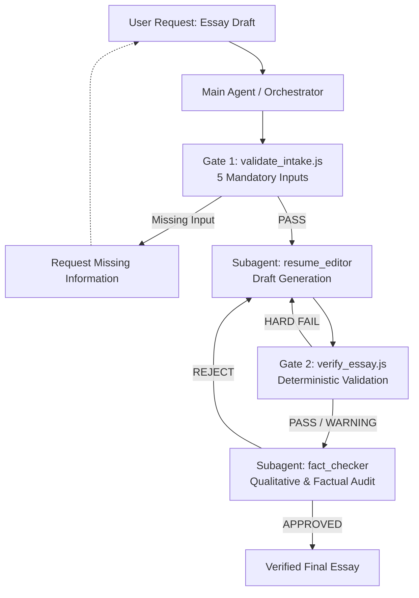

# 🚀 Resume-Helper-AgenticAI

Resume-Helper-AgenticAI is a closed-loop, multi-agent system for writing high-stakes employment essays and technical applications.

The system separates **objectively verifiable constraints** from **semantic and stylistic judgments**. Deterministic Node.js tools enforce measurable requirements such as character and byte limits, while specialized LLM agents handle job analysis, essay generation, and qualitative/factual auditing.

Rather than relying on a single LLM to generate and evaluate its own output, the system uses independent validation stages to reduce hallucination risk, prevent unsupported claims, identify corporate clichés, and preserve the candidate's authentic voice.

---

## 🏗️ System Architecture



### Closed-Loop Workflow

The system follows a gated revision loop:

1. **Input Contract Validation**
   Ensures that the company, job description, question, character limit, and candidate experience are sufficiently specified before drafting begins.

2. **Essay Generation**
   `resume_editor` generates a draft using the candidate's actual experience, job requirements, and structured writing rules.

3. **Deterministic Validation**
   `verify_essay.js` checks objectively measurable constraints such as character counts, byte limits, and predefined heuristic signals.

4. **Qualitative & Factual Audit**
   `fact_checker` independently reviews the draft for unsupported claims, fabricated experiences or metrics, role exaggeration, logical inconsistencies, and stylistic issues.

5. **Revision Loop**
   Failed constraints and audit feedback are returned to the editor for revision until the draft satisfies the required contracts.

---

## 🎯 Core Principles

### 1. Orthogonality: Hard Constraints vs. Heuristic Signals

The system deliberately separates **machine-enforceable constraints** from **advisory quality signals**.

#### Hard Constraints — `FAIL` → Mandatory Revision

These are requirements that can be evaluated deterministically:

* Exact character limits, with or without spaces.
* UTF-8 byte limits using `Buffer.byteLength`.
* Minimum and maximum boundaries.
* Required input completeness.
* Structural validation of generated output.

Semantic factual integrity is handled separately by the independent `fact_checker` agent rather than being treated as a purely deterministic property.

#### Heuristic Quality Signals — `PASS + WARNING`

These signals indicate potential quality issues without automatically invalidating a draft:

* Corporate clichés and generic buzzwords.
* Overused or unnatural expressions.
* Sentence-length uniformity and writing monotony.
* Phrasing and flow issues.
* Other stylistic patterns that may make the essay sound overly generated or generic.

Warnings are fed back to the editor as revision guidance, but they do not automatically fail the draft or create an unconditional revision loop.

---

### 2. Deterministic Verification

Where a requirement can be measured objectively, the system avoids asking an LLM to make the final decision.

For example:

```text
Maximum: 500 characters

499 → PASS
500 → PASS
501 → FAIL (Delta: +1)
```

This makes boundary conditions explicit and reproducible.

UTF-8 byte length is measured using Node.js's native `Buffer.byteLength`, while the current EUC-KR/CP949 handling uses a deterministic byte-estimation rule implemented in the verifier.

> **Note:** EUC-KR validation is intentionally kept separate from UTF-8 byte measurement because the two encodings have different byte-length characteristics.

---

### 3. Boundary-Condition Regression Tests

The repository includes a regression suite covering both hard constraints and the separation between hard failures and heuristic warnings.

The suite contains 12 cases:

| Test | Scenario                     | Expected Result  |
| ---- | ---------------------------- | ---------------- |
| TC01 | Maximum boundary             | `PASS`           |
| TC02 | Maximum exceeded by 1        | `FAIL`           |
| TC03 | Minimum boundary             | `PASS`           |
| TC04 | Minimum violated by 1        | `FAIL`           |
| TC05 | Boundary + cliché            | `PASS + WARNING` |
| TC06 | Hard violation + cliché      | `FAIL + WARNING` |
| BC01 | Exact maximum boundary       | `PASS`           |
| BC02 | Off-by-one maximum violation | `FAIL`           |
| BC03 | Exact minimum boundary       | `PASS`           |
| BC04 | Off-by-one minimum violation | `FAIL`           |
| BC05 | Hard/heuristic orthogonality | `PASS + WARNING` |
| BC06 | Byte-boundary validation     | `PASS / FAIL`    |

The purpose is not simply to test normal inputs, but to verify that the validator behaves correctly at **boundary conditions** and that heuristic warnings do not accidentally override hard constraints.

---

### 4. Independent Qualitative Auditing

The system uses a separate `fact_checker` agent rather than asking the writing agent to approve its own output.

The audit focuses on:

* Unsupported or fabricated experiences.
* Fabricated metrics or technical results.
* Incorrect company or job-related claims.
* Exaggeration of the candidate's actual role.
* Logical inconsistencies.
* Generic or overly artificial phrasing.

This separation reduces the risk of a generator reinforcing its own unsupported claims.

---

### 5. Candidate Voice Preservation

The goal is not to make every essay sound maximally polished or uniformly "professional."

The editor is instructed to preserve:

* The candidate's actual experience.
* Their reasoning process.
* Concrete technical details.
* Natural sentence rhythm.
* Individual phrasing where it does not harm clarity.

The system therefore favors **minimal, evidence-based editing** over aggressive rewriting.

In particular, the system avoids inventing achievements, technologies, responsibilities, or metrics simply to make an application appear stronger.

---

### 6. Single-Session Subagent Lifecycle

Subagents are designed to operate within a controlled lifecycle rather than repeatedly spawning independent processes.

The intended state progression is:

```text
INPUT_REQUIRED
      ↓
DRAFTING
      ↓
QUANTITATIVE_REVIEW
      ↓
QUALITATIVE_REVIEW
      ↓
COMPLETED
```

This provides a predictable revision workflow and keeps the responsibilities of each stage explicit.

---

## 📁 Repository Structure

```text
Resume-Helper-AgenticAI/
├── .env.example
├── .gitignore
├── AGENTS.md
├── LICENSE
├── package.json
├── README.md
├── draft_input.template.md
│
├── agents/
│   ├── fact_checker.md
│   ├── job_analyst.md
│   └── resume_editor.md
│
├── samples/
│   ├── sample_input.md
│   ├── sample_output.md
│   └── sample_profile.md
│
├── tests/
│   ├── run_tests.js
│   ├── test_cases.json
│   └── test_hard_vs_heuristic.js
│
└── tools/
    ├── test_hard_vs_heuristic.js
    ├── validate_intake.js
    └── verify_essay.js
```

### Key Components

| Component                   | Responsibility                                                        |
| --------------------------- | --------------------------------------------------------------------- |
| `validate_intake.js`        | Validates the mandatory input contract                                |
| `verify_essay.js`           | Performs deterministic character/byte validation and heuristic checks |
| `resume_editor.md`          | Controls essay generation and revision behavior                       |
| `fact_checker.md`           | Performs independent qualitative and factual auditing                 |
| `job_analyst.md`            | Deconstructs job descriptions and extracts relevant capabilities      |
| `test_hard_vs_heuristic.js` | Tests boundary conditions and hard/heuristic separation               |
| `run_tests.js`              | Runs the benchmark test suite                                         |
| `AGENTS.md`                 | Defines the overall multi-agent workflow and behavioral contract      |

---

## 🔍 Design Philosophy

The project follows a simple engineering principle:

> **Use deterministic code where correctness can be measured, and use LLM agents where semantic judgment is required.**

LLMs are useful for:

* Understanding job descriptions.
* Structuring candidate experiences.
* Generating natural language.
* Evaluating semantic consistency.
* Providing qualitative feedback.

Code is preferable for:

* Character limits.
* Byte limits.
* Boundary conditions.
* Structural contracts.
* Regression testing.

This separation makes the system more predictable than relying on a single LLM prompt to perform generation, validation, and self-correction simultaneously.

---

## 👤 Author

**Hasung Cho**

* Email: [lifeofcho23@gmail.com](mailto:lifeofcho23@gmail.com)

---

## 📄 License

This project is open-source under the [MIT License](LICENSE).
