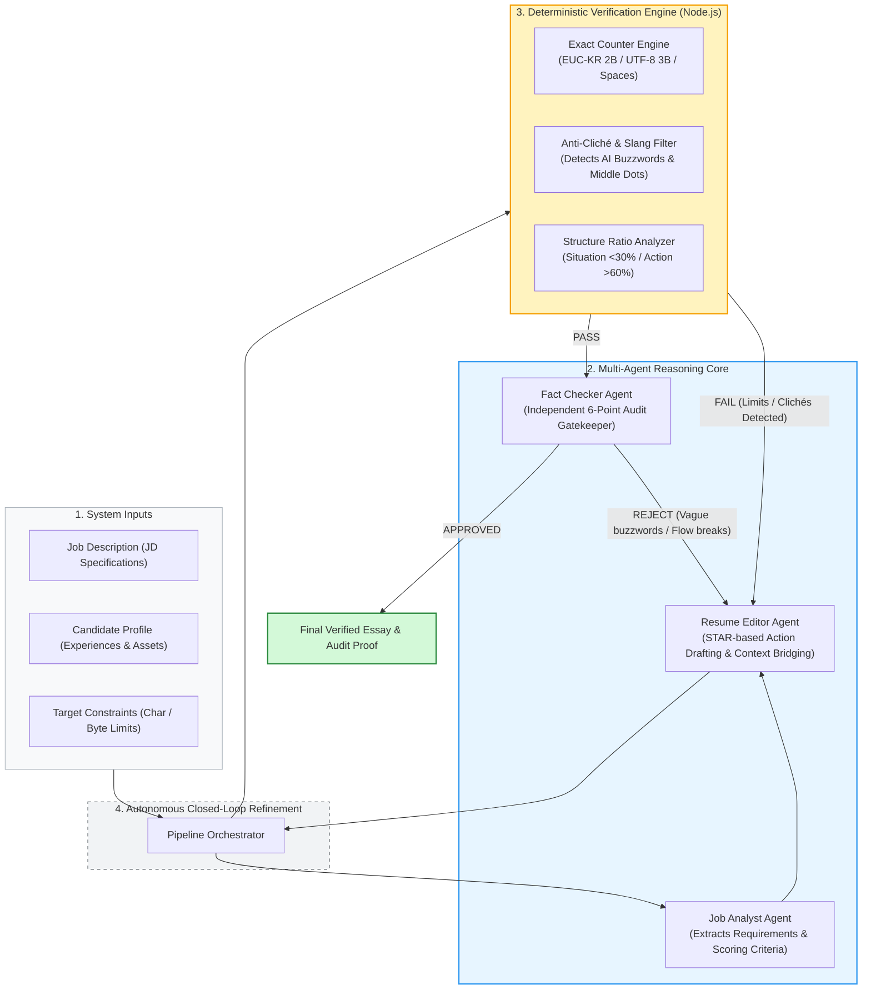

# Resume-Helper-AgenticAI

[](https://nodejs.org/)
[]()
[]()
[](LICENSE)

> **A Multi-Agent System with Exact Character/Byte Verification & Autonomous Quality Audits for Job Application Essays.**

---

## 📌 Overview

Writing application essays for tech companies requires meeting **strict quantitative constraints**:
* Exact character counts (with/without spaces).
* Multi-byte encoding limits (EUC-KR 2-byte, UTF-8 3-byte).
* Filtering out repetitive, generic AI clichés ("synergy", "passionately", "contribute globally").

Large Language Models (GPT, Claude, Gemini) struggle to count characters mathematically and often hallucinate counts or introduce clichés. 

**Resume-Helper-AgenticAI** solves this by combining specialized AI agents with deterministic Node.js verification scripts. It provides a complete pipeline that drafts, measures, audits, and auto-corrects application essays until all constraints are satisfied.And ofcourse you must definitely check if for yourself for the one last time before turning it in. 

---

## 🏗️ System Architecture & Multi-Agent Pipeline

The system decouples drafting from deterministic verification to eliminate AI hallucinations and ensure quantitative compliance:



---

## 🚀 Key Features

### 1. Exact Verification Tool (`tools/verify_essay.js`)
* **Multi-Byte Encoding Precision**: Calculates exact character counts, EUC-KR (2 bytes), and UTF-8 (3 bytes) with zero error.
* **Anti-Cliché Filter**: Scans for and flags artificial AI idioms and phrases (`귀사`, `시너지`, `역량을 함양`, `100% 일치`, middle-dot `·`).
* **Structure Ratio Analysis**: Heuristically checks the balance between **Situation (<30%)**, **Engineering Action (>60%)**, and **Results (<10%)**.

### 2. Specialized Multi-Agent Roles (`agents/`)
* **Job Analyst (`job_analyst.md`)**: Parses job descriptions and extracts core technical requirements.
* **Resume Editor (`resume_editor.md`)**: Drafts experience-focused essays using the STAR framework with a bottom-line-first approach (두괄식).
* **Fact Checker (`fact_checker.md`)**: Acts as an independent auditor to ensure the essay reflects authentic problem-solving and honest facts.

### 3. Automated Test Suite (`tests/`)
* Includes `tests/test_cases.json` covering diverse business & tech scenarios (Performance Marketing, CRM & Retention, Inbound Growth Strategy).
* Run regression tests with a single command to ensure the tools work reliably.

---

## 📂 Repository Structure

```text
Resume-Helper-AgenticAI/
├── README.md               # Documentation & workflow overview
├── package.json            # Scripts & project metadata
├── LICENSE                 # MIT License
├── .gitignore              # Privacy safeguards
├── agents/                 # Specialized agent specifications
│   ├── job_analyst.md      # JD deconstruction
│   ├── resume_editor.md    # STAR draft generator
│   └── fact_checker.md     # Independent audit gatekeeper
├── tools/                  # Deterministic verification tools
│   ├── verify_essay.js     # Character, byte, and cliché validator
│   └── orchestrator.js     # Pipeline entrypoint
├── tests/                  # Automated test suite
│   ├── test_cases.json     # Standard evaluation cases
│   └── run_tests.js        # Test runner
└── samples/                # Sample demonstration data
    ├── sample_profile.md   # Mock candidate profile (Marketing Specialist)
    └── sample_output.md    # Verified sample essay
```

---

## ⚡ Getting Started

### 1. Run the Test Suite
Test the verification tools against the standard evaluation cases:
```bash
npm test
```

### 2. Verify an Essay Draft Directly
Check any draft text for character limits, byte sizes, and clichés:
```bash
# Check with character limits (e.g., 500 to 1,000 characters)
node tools/verify_essay.js --text "Your draft essay here..." --min 500 --max 1000

# Check EUC-KR byte limits (e.g., max 2,000 bytes)
node tools/verify_essay.js --text "Your draft essay here..." --max 2000 --type euckr

# Validate an entire file and output JSON
node tools/verify_essay.js --file ./samples/sample_output.md --json
```

---

## 👤 Author

* **Hasung Cho**
  * Email: lifeofcho23@gmail.com
  * GitHub: [@BR8KTIME](https://github.com/BR8KTIME)

---

## 📄 License
This project is open-source under the [MIT License](LICENSE).
