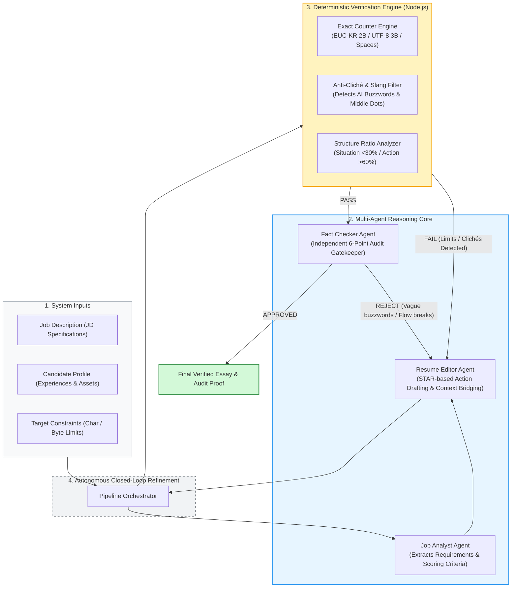

# Resume-Helper-AgenticAI

[](https://nodejs.org/)
[]()
[]()
[](LICENSE)

> **A Multi-Agent System with Exact Character/Byte Verification & Autonomous Quality Audits for Job Application Essays.**

---

## 📌 Overview

Writing application essays for tech companies requires meeting **strict quantitative constraints**:
* Exact character counts (with/without spaces).
* Multi-byte encoding limits (EUC-KR 2-byte, UTF-8 3-byte).
* Filtering out repetitive, generic AI clichés ("synergy", "passionately", "contribute globally").

Large Language Models (GPT, Claude, Gemini) struggle to count characters mathematically and often hallucinate counts or introduce clichés. 

**Resume-Helper-AgenticAI** solves this by combining specialized AI agents with deterministic Node.js verification scripts. It provides a complete pipeline that drafts, measures, audits, and auto-corrects application essays until all constraints are satisfied.And ofcourse you must definitely check if for yourself for the one last time before turning it in. 

---

## 🏗️ System Architecture & Multi-Agent Pipeline

The system decouples drafting from deterministic verification to eliminate AI hallucinations and ensure quantitative compliance:



---

## 🚀 Key Features

### 1. Deterministic Verification Gates (`tools/`)
* **Gate 1: Input Contract Gatekeeper (`tools/validate_intake.js`)**: Blocks execution immediately if any of the 5 mandatory inputs (Company, Official JD, Question Prompt, Char Limit, Raw Experience) are missing. Eliminates hallucination at the source.
* **Gate 2: Exact Quantitative Verifier (`tools/verify_essay.js`)**:
  - **Multi-Byte Encoding Precision**: Calculates exact character counts, EUC-KR (2 bytes), and UTF-8 (3 bytes) with zero error.
  - **Sentence Variance & Monotony Audit**: Breaks down sentence-by-sentence character lengths. Fails uniform AI monotony (uniform 40~55 chars); requires balanced punchy short sentences (20~35 chars) and compound action sentences (70~90+ chars).
  - **Anti-Cliché Filter**: Scans for and flags artificial AI idioms and phrases (`귀사`, `시너지`, `역량을 함양`, `100% 일치`, middle-dot `·`).

### 2. Specialized Multi-Agent Roles (`agents/` & `AGENTS.md`)
* **Job Analyst (`job_analyst.md`)**: Parses job descriptions and extracts core technical requirements.
* **Resume Editor (`resume_editor.md`)**: Drafts experience-focused essays using the STAR framework with a bottom-line-first approach (두괄식) and candidate-authentic engineering diction.
* **Fact Checker (`fact_checker.md`)**: Acts as an independent auditor to ensure the essay reflects authentic problem-solving, honest facts, and zero fabricated CS tropes.
* **Closed-Loop Specification (`AGENTS.md`)**: Standard multi-agent orchestration specification for the 8-step closed-loop evaluator-optimizer architecture.

### 3. Automated Test Suite (`tests/`)
* Includes `tests/test_cases.json` covering diverse business & tech scenarios (Performance Marketing, CRM & Retention, Inbound Growth Strategy).
* Run regression tests with a single command to ensure the tools work reliably.

---

## 📂 Repository Structure

```text
Resume-Helper-AgenticAI/
├── README.md                  # Documentation & workflow overview
├── AGENTS.md                  # Standard Multi-Agent Closed-Loop Specification
├── package.json               # Scripts & project metadata
├── LICENSE                    # MIT License
├── .gitignore                 # Privacy safeguards
├── draft_input.template.md    # Starter template for drafting essays
├── agents/                    # Specialized agent specifications
│   ├── job_analyst.md         # JD deconstruction
│   ├── resume_editor.md       # STAR draft generator & optimizer
│   └── fact_checker.md        # Independent audit gatekeeper
├── tools/                     # Deterministic verification tools
│   ├── validate_intake.js     # Gate 1: Mandatory input contract gatekeeper
│   ├── verify_essay.js        # Gate 2: Character, byte, variance & cliché validator
│   └── orchestrator.js        # Full pipeline runner (with condition-preserving feedback)
├── tests/                     # Automated test suite
│   ├── test_cases.json        # Standard evaluation cases
│   └── run_tests.js           # Test runner
└── samples/                   # Sample demonstration data
    ├── sample_profile.md      # Mock candidate profile (Marketing Specialist)
    ├── sample_input.md        # Pre-configured input notes & draft
    └── sample_output.md       # Verified sample essay & audit report
```

---

## ⚡ Getting Started

### 1. Run the Autonomous Pipeline Orchestrator (`orchestrator.js`)
Execute the end-to-end multi-agent verification pipeline. Supports two modes:

#### Mode A: Full Autonomous Agentic Closed-Loop (with LLM API)
With a Google Gemini API key, the orchestrator autonomously generates drafts, runs deterministic verification, and re-drafts upon failure until passing the 6-point audit:
```bash
# 1. Configure your API key (copy .env.example to .env)
cp .env.example .env
# Add GEMINI_API_KEY=your_key_here to .env (Get free key at: https://aistudio.google.com/)

# 2. Run the autonomous closed-loop
node tools/orchestrator.js

# Or provide your key directly via CLI:
node tools/orchestrator.js --key "your_gemini_api_key"
```

#### Mode B: Offline Deterministic Verifier Mode
Without an API key, the pipeline deterministically validates existing drafts against exact byte/character limits and banned clichés without network calls:
```bash
node tools/orchestrator.js --input ./samples/sample_input.md --output ./draft_output.md
```

### 2. Standalone Quantitative Verification Tool (`verify_essay.js`)
Check any individual draft snippet or file for exact character counts, EUC-KR bytes, and clichés:
```bash
# Verify character limits (e.g., 500 to 800 characters)
node tools/verify_essay.js --text "Your draft essay text here..." --min 500 --max 800

# Verify EUC-KR byte limits (e.g., max 2,000 bytes)
node tools/verify_essay.js --text "Your draft essay text here..." --max 2000 --type euckr

# Validate an entire file and output structured JSON
node tools/verify_essay.js --file ./samples/sample_output.md --json
```

### 3. Run the Automated Regression Test Suite
Run continuous integration tests against diverse evaluation cases:
```bash
npm test
```

---

## 👤 Author

* **Hasung Cho**
  * Email: lifeofcho23@gmail.com

---

## 📄 License
This project is open-source under the [MIT License](LICENSE).
