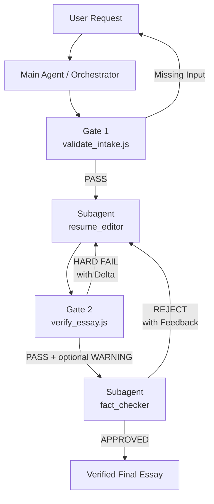

# 🚀 Resume-Helper-AgenticAI

**Resume-Helper-AgenticAI** is a multi-agent workflow for generating and validating job application essays.

The system is designed around one principle:

> **Use the Main Agent for orchestration and semantic decisions, and use deterministic code wherever correctness can be measured.**

Instead of asking a single LLM to generate, evaluate, and revise an essay by itself, the workflow separates responsibilities across a **Main Agent (Orchestrator)**, specialist subagents, and deterministic validation tools.

The result is an **Evaluator–Optimizer loop** in which generated drafts are checked against objective constraints and then reviewed for factual and qualitative issues before being returned to the user.

---

## 🏗️ System Architecture


```mermaid
flowchart TD
    Req["User Request"] --> Orch["Main Agent / Orchestrator"]

    Orch --> Gate1["Gate 1<br/>validate_intake.js"]

    Gate1 -- "Missing Input" --> Req

    Gate1 -- "PASS" --> Editor["Subagent<br/>resume_editor"]

    Editor --> Gate2["Gate 2<br/>verify_essay.js"]

    Gate2 -- "HARD FAIL<br/>with Delta" --> Editor

    Gate2 -- "PASS + optional WARNING" --> Checker["Subagent<br/>fact_checker"]

    Checker -- "REJECT<br/>with Feedback" --> Editor

    Checker -- "APPROVED" --> Done["Verified Final Essay"]
```

### Main Agent as the Orchestrator

The **Main Agent is the control layer of the system**.

It does not directly own essay generation. Instead, it coordinates the workflow defined in [`AGENTS.md`](AGENTS.md):

* validates whether the required input contract is satisfied
* delegates drafting to `resume_editor`
* invokes deterministic validation through `verify_essay.js`
* routes hard-constraint failures back to the editor with specific feedback
* delegates qualitative and factual review to `fact_checker`
* routes rejected drafts back for revision
* terminates the workflow when the required validation stages are satisfied

The specialist agents are intentionally separated from the Main Agent so that **workflow control, content generation, and validation remain distinct responsibilities**.

---

## 🔄 Closed-Loop Workflow

The workflow consists of gated generation and revision stages.

### 1. Input Contract Validation

Before drafting begins, `validate_intake.js` checks whether the required information is available:

1. `company` — target company
2. `job_description` — job description and required capabilities
3. `question` — application question
4. `char_limit` — character limit
5. `user_experience` — candidate's actual experience and facts

If required information is missing, the Main Agent requests the missing information instead of allowing the drafting stage to proceed.

### 2. Draft Generation

Once the input contract is satisfied, the Main Agent delegates the writing task to `resume_editor`.

The editor is responsible for:

* interpreting the application question
* structuring the candidate's experience
* emphasizing engineering actions and decisions
* preserving the candidate's actual experience
* controlling essay length
* avoiding unsupported achievements and fabricated details
* maintaining the candidate's natural voice

The editor's behavior is defined in [`agents/resume_editor.md`](agents/resume_editor.md).

### 3. Deterministic Validation

The generated draft is passed to `verify_essay.js`.

The verifier separates two types of checks:

**Hard constraints**

* character limits
* minimum / maximum boundaries
* UTF-8 byte limits
* EUC-KR/CP949-oriented byte estimation
* structural validation

A hard-constraint violation produces `FAIL` and a concrete delta.

For example:

```text
Maximum: 500 characters

499 → PASS
500 → PASS
501 → FAIL (+1)
```

**Heuristic quality signals**

* corporate clichés
* generic expressions
* sentence-length uniformity
* writing monotony
* other predefined stylistic patterns

Heuristic findings are reported as warnings rather than automatically invalidating the draft.

This distinction prevents a subjective quality signal such as a cliché from being treated as equivalent to an objective constraint violation.

### 4. Revision Loop

When `verify_essay.js` reports a hard failure, the Main Agent routes the draft and validation feedback back to `resume_editor`.

The editor then revises the draft against the specific failure rather than restarting the writing process from scratch.

The intended loop is:

```text
Draft
  ↓
Deterministic Validation
  ↓
FAIL
  ↓
Delta Feedback
  ↓
resume_editor
  ↓
Draft
```

### 5. Independent Qualitative / Factual Audit

After deterministic validation passes, the Main Agent delegates the draft to `fact_checker`.

The fact checker reviews issues that are difficult to establish through simple deterministic rules:

* unsupported experiences
* fabricated metrics
* exaggerated responsibilities
* incorrect company or job claims
* logical inconsistencies
* overly generic or artificial wording

If the draft is rejected, the feedback is routed back to `resume_editor` for another revision.

Only after the required validation stages are satisfied is the draft returned as the final output.

---

## 🧩 Agent Roles

### Main Agent — Orchestrator

The Main Agent owns:

* workflow control
* agent delegation
* validation routing
* revision feedback routing
* termination conditions

It acts as the **control plane** rather than the primary writer.

The orchestration policy is defined in [`AGENTS.md`](AGENTS.md).

### `resume_editor`

Responsible for:

* application-question analysis
* STAR structuring
* engineering-action-focused writing
* character-count optimization
* candidate voice preservation
* revision based on validation feedback

The editor is explicitly instructed not to invent experiences, metrics, technologies, or responsibilities.

See [`agents/resume_editor.md`](agents/resume_editor.md).

### `fact_checker`

Provides an independent review of the generated draft.

Its purpose is to prevent the writing agent from becoming the sole evaluator of its own output.

See [`agents/fact_checker.md`](agents/fact_checker.md).

### `job_analyst`

Analyzes job descriptions and extracts:

* required capabilities
* technical requirements
* role responsibilities
* company / position context

Its output can be used by the Main Agent and `resume_editor` when job-specific analysis is required.

See [`agents/job_analyst.md`](agents/job_analyst.md).

---

## 🛡️ Deterministic Validation Tools

### `tools/validate_intake.js`

Validates the five required input fields before essay generation.

```text
company
job_description
question
char_limit
user_experience
```

The tool returns a non-zero exit code when required input is missing.

### `tools/verify_essay.js`

Performs objective validation and heuristic analysis.

It reports metrics including:

```text
Character count with spaces
Character count without spaces
UTF-8 byte count
EUC-KR-oriented byte estimate
Detected clichés
Sentence variance
Constraint violations
```

The verifier returns structured JSON when invoked with `--json`, making its output suitable for integration with an agent workflow or external tooling.

---

## 🎯 Design Principle: Hard Constraints vs. Heuristics

A central design decision is to avoid treating every writing requirement as an LLM judgment.

### Hard Constraints

If a requirement can be measured objectively, code should make the final decision.

Examples:

```text
Maximum character count
Minimum character count
Byte limit
Required input fields
Boundary conditions
```

### Heuristic Signals

Some properties are inherently subjective and are therefore reported separately.

Examples:

```text
Corporate clichés
Generic wording
Sentence-length uniformity
Writing monotony
```

The distinction is intentional:

```text
Hard Constraint Violation
        ↓
       FAIL
        ↓
    Revision

Heuristic Warning
        ↓
PASS + WARNING
        ↓
Optional Improvement
```

This prevents subjective style heuristics from accidentally becoming hard validation rules.

---

## 🧪 Boundary-Condition Regression Tests

The repository contains a dedicated regression suite for validating the distinction between hard constraints and heuristic signals.

The suite contains **12 test cases** covering:

| Test | Scenario                       | Expected         |
| ---- | ------------------------------ | ---------------- |
| TC01 | Character limit violation      | `FAIL`           |
| TC02 | Byte limit violation           | `FAIL`           |
| TC03 | Cliché without hard violation  | `PASS + WARNING` |
| TC04 | Sentence variance warning      | `PASS + WARNING` |
| TC05 | Hard violation + cliché        | `FAIL + WARNING` |
| TC06 | Hard constraints satisfied     | `PASS`           |
| BC01 | Exact maximum boundary         | `PASS`           |
| BC02 | Maximum +1                     | `FAIL`           |
| BC03 | Exact minimum boundary         | `PASS`           |
| BC04 | Minimum -1                     | `FAIL`           |
| BC05 | Exact boundary + cliché        | `PASS + WARNING` |
| BC06 | EUC-KR / UTF-8 byte boundaries | `PASS / FAIL`    |

The purpose is not only to test ordinary inputs, but also to verify **off-by-one behavior and the orthogonality between hard failures and heuristic warnings**.

---

## 📁 Repository Structure

```text
Resume-Helper-AgenticAI/
├── .env.example
├── .gitignore
├── AGENTS.md
├── LICENSE
├── README.md
├── draft_input.template.md
├── package.json
│
├── agents/
│   ├── fact_checker.md
│   ├── job_analyst.md
│   └── resume_editor.md
│
├── samples/
│   ├── sample_input.md
│   ├── sample_output.md
│   └── sample_profile.md
│
├── tests/
│   ├── run_tests.js
│   ├── test_cases.json
│   └── test_hard_vs_heuristic.js
│
└── tools/
    ├── test_hard_vs_heuristic.js
    ├── validate_intake.js
    └── verify_essay.js
```

### Component Responsibilities

| Component                         | Responsibility                                                   |
| --------------------------------- | ---------------------------------------------------------------- |
| `AGENTS.md`                       | Defines the Main Agent's orchestration policy and agent workflow |
| `agents/resume_editor.md`         | Essay generation and revision rules                              |
| `agents/fact_checker.md`          | Independent qualitative and factual audit                        |
| `agents/job_analyst.md`           | Job-description analysis                                         |
| `tools/validate_intake.js`        | Input contract validation                                        |
| `tools/verify_essay.js`           | Deterministic essay verification and heuristic signals           |
| `tools/test_hard_vs_heuristic.js` | Boundary and orthogonality regression tests                      |
| `tests/run_tests.js`              | Benchmark test runner                                            |
| `tests/test_cases.json`           | Benchmark inputs and expected results                            |

---

## 🛠️ Quickstart

### 1. Validate Required Inputs

```bash
node tools/validate_intake.js
```

### 2. Run Boundary Regression Tests

```bash
node tools/test_hard_vs_heuristic.js
```

### 3. Run the Full Test Suite

```bash
npm test
```

### 4. Verify an Essay

```bash
node tools/verify_essay.js \
  --text "Your essay content..." \
  --max 500
```

For structured JSON output:

```bash
node tools/verify_essay.js \
  --text "Your essay content..." \
  --max 500 \
  --json
```

To verify a file:

```bash
node tools/verify_essay.js \
  --file samples/sample_output.md \
  --max 800
```

---

## 🧠 Design Philosophy

The project follows a simple engineering principle:

> **Use LLM agents where semantic reasoning is required, and deterministic code where correctness can be measured.**

LLM agents are useful for:

* understanding job descriptions
* structuring candidate experiences
* generating natural language
* reasoning about semantic consistency
* providing qualitative feedback

Deterministic code is preferable for:

* character limits
* byte limits
* boundary conditions
* input contracts
* regression testing

The Main Agent connects these components into a single workflow while keeping generation, validation, and auditing as separate responsibilities.

This architecture is intended to make the revision process **observable, testable, and less dependent on a single model's self-evaluation**.

---

## 👤 Author

**Hasung Cho**

* GitHub: [BR8KTIME](https://github.com/BR8KTIME)

---

## 📄 License

This project is open-source under the [MIT License](LICENSE).
